# Account

Core authentication module providing user registration, login, logout, and current user retrieval.

## Overview

The Account feature is the foundation of Passage authentication. It handles credential-based authentication flows and integrates with the [Tokens](../Tokens/README.md) feature for JWT issuance and the [Verification](../Verification/README.md) feature for post-registration verification.

## Configuration

```swift
Passage.Configuration(
    // ... other config ...
    routes: .init(
        group: "auth",                              // Base path for auth routes
        register: .init(path: "register"),          // POST /auth/register
        login: .init(path: "login"),                // POST /auth/login
        logout: .init(path: "logout"),              // POST /auth/logout
        currentUser: .init(path: "me", shouldBypassGroup: true)  // GET /me
    )
)
```

### Configuration Options

| Option | Type | Default | Description |
|--------|------|---------|-------------|
| `routes.group` | `[PathComponent]` | `["auth"]` | Base path for all auth routes |
| `routes.register` | `Register` | `"register"` | Registration endpoint path |
| `routes.login` | `Login` | `"login"` | Login endpoint path |
| `routes.logout` | `Logout` | `"logout"` | Logout endpoint path |
| `routes.currentUser` | `CurrentUser` | `"me"` | Current user endpoint path |
| `routes.currentUser.shouldBypassGroup` | `Bool` | `true` | Register outside auth group (e.g., `/me` instead of `/auth/me`) |

## Registration

Registration creates a new user with an identifier (email, phone, or username) and password.

**Flow:**
1. Password hashed with BCrypt
2. User created with identifier and password hash
3. Verification code sent (fire-and-forget)

**Behavior:**
- Accepts `email`, `phone`, or `username` as identifier
- Password is securely hashed before storage
- Verification code is sent automatically after registration
- Registration succeeds even if verification code fails to send (fire-and-forget pattern)
- User can attempt login immediately, but will be blocked if email/phone is not verified

## Login

Login authenticates a user and issues access/refresh tokens.

**Flow:**
1. Find user by identifier (email/phone/username)
2. Validate password hash
3. Check verification status
4. Store user in session (if sessions enabled)
5. Issue JWT access token + opaque refresh token

**Behavior:**
- Returns `AuthUser` with tokens and user info on success
- **Blocks unverified users** - throws `emailIsNotVerified` or `phoneIsNotVerified` if identifier not verified
- Supports dual authentication: session-based (for SSR) and JWT Bearer (for API)

**Response Format:**
```json
{
  "accessToken": "eyJhbGciOiJS...",
  "refreshToken": "abc123...",
  "tokenType": "Bearer",
  "expiresIn": 3600,
  "user": {
    "id": "user-uuid",
    "email": "user@example.com",
    "phone": null
  }
}
```

## Logout

Logout ends the user session and revokes refresh tokens.

**Flow:**
1. Remove user from session
2. Revoke all refresh tokens for user

**Behavior:**
- Safe operation - returns OK even if no user is authenticated
- Revokes all refresh tokens to prevent reuse
- Requires authentication (session or Bearer token)

## Current User

Returns information about the currently authenticated user.

**Behavior:**
- Requires authentication (session or Bearer token)
- Returns user ID, email, and phone
- Can be registered outside the auth group via `shouldBypassGroup: true`

**Response Format:**
```json
{
  "id": "user-uuid",
  "email": "user@example.com",
  "phone": null
}
```

## Routes & Endpoints

| Method | Default Path | Auth | Description |
|--------|--------------|------|-------------|
| POST | `/auth/register` | No | Create new user with identifier + password |
| POST | `/auth/login` | No | Authenticate user, receive tokens |
| POST | `/auth/logout` | Yes | End session, revoke refresh tokens |
| GET | `/me` | Yes | Get current authenticated user |

**Note:** The `/me` endpoint bypasses the auth group by default. Set `shouldBypassGroup: false` to use `/auth/me` instead.

## Flow Diagram

```mermaid
flowchart TD
    subgraph Registration
        R1[POST /auth/register] --> R2[Hash password]
        R2 --> R3[Create user]
        R3 --> R4[Send verification code]
        R4 --> R5[Return 200 OK]
        R4 -.->|fire-and-forget| R5
    end

    subgraph Login
        L1[POST /auth/login] --> L2[Find user by identifier]
        L2 --> L3{User found?}
        L3 -->|No| L4[Throw invalid credentials]
        L3 -->|Yes| L5[Verify password]
        L5 --> L6{Password valid?}
        L6 -->|No| L4
        L6 -->|Yes| L7{Email/phone verified?}
        L7 -->|No| L8[Throw not verified]
        L7 -->|Yes| L9[Store in session]
        L9 --> L10[Issue tokens]
        L10 --> L11[Return AuthUser]
    end

    subgraph Logout
        O1[POST /auth/logout] --> O2[Remove from session]
        O2 --> O3[Revoke refresh tokens]
        O3 --> O4[Return 200 OK]
    end
```



## Implementation Details

### Dual-Mode Responses

The Account routes support both JSON API and HTML form submissions:

**JSON API Mode:**
- Register returns `200 OK`
- Login returns `AuthUser` JSON
- Used when `Accept: application/json` or non-form content type

**HTML Form Mode:**
- Renders Leaf templates on success/failure
- Re-renders form with error messages on validation failure
- Requires view templates configured in `configuration.views`

### Authentication Middleware

Protected routes (`logout`, `currentUser`) use stacked authenticators:
1. `PassageSessionAuthenticator` - Checks Vapor session for authenticated user
2. `PassageBearerAuthenticator` - Validates JWT Bearer token from `Authorization` header

Both authenticators populate `request.auth` with the user if valid credentials found.

### Error Handling

| Error | Trigger |
|-------|---------|
| `invalidEmailOrPassword` | User not found or wrong password |
| `emailIsNotVerified` | Email identifier not verified |
| `phoneIsNotVerified` | Phone identifier not verified |
| `passwordIsNotSet` | User has no password (e.g., OAuth-only user) |
| `emailAlreadyRegistered` | Duplicate email on registration |
| `phoneAlreadyRegistered` | Duplicate phone on registration |

## Related Features

- [Tokens](../Tokens/README.md) - JWT access tokens and refresh token management
- [Verification](../Verification/README.md) - Email/phone verification codes
- [Views](../Views/README.md) - HTML form rendering for web-based auth flows
- [Passwordless](../Passwordless/README.md) - Magic link authentication (alternative to password)
