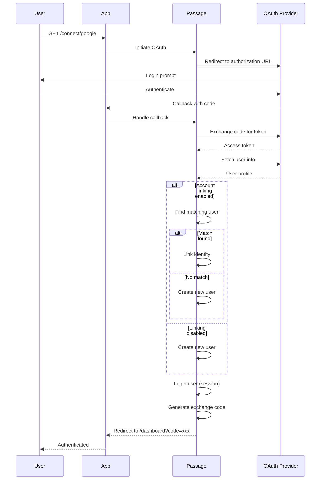

# Federated Login

OAuth/OpenID Connect authentication via external identity providers (Google, GitHub, Apple, etc.).

## Overview

The Federated Login feature enables users to authenticate using third-party OAuth providers. When a user logs in via OAuth, Passage receives their identity information and either logs them into an existing account or creates a new one. The feature integrates with [Account Linking](../Linking/README.md) to match OAuth identities with existing local accounts.

**Key capabilities:**
- OAuth 2.0 / OpenID Connect authentication
- Multiple provider support (Google, GitHub, Apple, custom)
- Automatic account linking by verified email/phone
- Manual account linking with user confirmation
- Exchange code flow for API clients
- Session + JWT dual authentication

## Configuration

```swift
Passage.Configuration(
    // ... other config ...
    federatedLogin: .init(
        routes: .init(group: "connect"),            // Base path: /auth/connect
        providers: [
            .init(provider: .google),               // /auth/connect/google
            .init(provider: .github),               // /auth/connect/github
        ],
        accountLinking: .init(
            resolution: .automatic(
                matchBy: [.email],                  // Match by verified email
                onAmbiguity: .requestManualSelection
            )
        ),
        redirectLocation: "/dashboard"              // Redirect after login
    )
)
```

### Configuration Options

| Option | Type | Default | Description |
|--------|------|---------|-------------|
| `routes.group` | `[PathComponent]` | `["connect"]` | Base path for OAuth routes |
| `providers` | `[Provider]` | `[]` | List of OAuth provider configurations |
| `accountLinking` | `AccountLinking` | `.disabled` | Account linking behavior |
| `redirectLocation` | `String` | `"/"` | Redirect URL after successful login |

**Provider Options:**

| Option | Type | Default | Description |
|--------|------|---------|-------------|
| `provider` | `FederatedProvider` | - | OAuth provider (Google, GitHub, etc.) |
| `routes.login` | `[PathComponent]` | Provider name | Login initiation path |
| `routes.callback` | `[PathComponent]` | Provider + `/callback` | OAuth callback path |

**Account Linking Options:**

| Option | Type | Default | Description |
|--------|------|---------|-------------|
| `resolution` | `LinkingResolution` | `.disabled` | Linking strategy |
| `stateExpiration` | `TimeInterval` | `600` (10 min) | Manual linking state timeout |

## OAuth Flow

### Login Initiation

1. User navigates to `/auth/connect/google` (or other provider)
2. Passage redirects to OAuth provider's authorization URL
3. User authenticates with the provider
4. Provider redirects back to callback URL with authorization code

### Callback Processing

1. OAuth callback received at `/auth/connect/google/callback`
2. Authorization code exchanged for access token
3. User info fetched from provider
4. `FederatedIdentity` constructed with verified emails/phones
5. Account linking resolution applied (see below)
6. User logged in (session + exchange code issued)
7. Redirect to `redirectLocation` with `?code=<exchange_code>`

### Account Linking Resolution

| Resolution | Behavior |
|------------|----------|
| `.disabled` | Always create new user |
| `.automatic(matchBy:onAmbiguity:)` | Auto-link if verified email/phone matches existing user |
| `.manual(matchBy:)` | Prompt user to select account to link |

See [Account Linking](../Linking/README.md) for detailed documentation.

## Routes & Endpoints

Routes are dynamically generated based on configured providers:

| Method | Path Pattern | Description |
|--------|--------------|-------------|
| GET | `/auth/connect/{provider}` | Initiate OAuth flow |
| GET | `/auth/connect/{provider}/callback` | OAuth callback handler |

**Example with Google and GitHub:**

| Method | Path | Description |
|--------|------|-------------|
| GET | `/auth/connect/google` | Start Google OAuth |
| GET | `/auth/connect/google/callback` | Google callback |
| GET | `/auth/connect/github` | Start GitHub OAuth |
| GET | `/auth/connect/github/callback` | GitHub callback |

## Flow Diagram



## Implementation Details

### FederatedIdentity

OAuth providers return a `FederatedIdentity` containing:

```swift
struct FederatedIdentity {
    let identifier: Identifier          // Primary identifier (federated type)
    let provider: FederatedProvider.Name
    let verifiedEmails: [String]        // Emails verified by provider
    let verifiedPhoneNumbers: [String]  // Phones verified by provider
    let displayName: String?
    let profilePictureURL: String?
}
```

Only **verified** emails/phones from the provider are used for account linking.

### Exchange Code Flow

After OAuth completion, users are redirected with an exchange code:

```
https://yourapp.com/dashboard?code=<exchange_code>
```

API clients exchange this code for JWT tokens:

```http
POST /auth/exchange
Content-Type: application/json

{"code": "<exchange_code>"}
```

See [Tokens](../Tokens/README.md) for exchange code details.

### FederatedLoginService Protocol

Implement this protocol to integrate OAuth providers:

```swift
protocol FederatedLoginService {
    func register(
        router: any RoutesBuilder,
        origin: URL,
        group: [PathComponent],
        config: Configuration.FederatedLogin,
        onSignIn: @escaping (Request, FederatedIdentity) async throws -> Response
    ) throws
}
```

### OAuth with Imperial

For OAuth integration, use [passage-imperial](https://github.com/rozd/passage-imperial) - a ready-to-use implementation based on the [Imperial](https://github.com/vapor-community/Imperial) library:

```swift
import PassageImperial

let federatedLogin = ImperialFederatedLoginService()

try await app.passage.configure(
    services: .init(
        store: store,
        federatedLogin: federatedLogin
    ),
    configuration: .init(
        // ... other config ...
        federatedLogin: .init(
            providers: [
                .init(provider: .google(
                    clientId: Environment.get("GOOGLE_CLIENT_ID")!,
                    clientSecret: Environment.get("GOOGLE_CLIENT_SECRET")!
                )),
                .init(provider: .github(
                    clientId: Environment.get("GITHUB_CLIENT_ID")!,
                    clientSecret: Environment.get("GITHUB_CLIENT_SECRET")!
                ))
            ]
        )
    )
)
```

### Error Handling

| Error | Trigger |
|-------|---------|
| `federatedLoginNotConfigured` | FederatedLoginService not provided |
| `federatedProviderNotFound` | Unknown provider in callback |
| `federatedIdentityInvalid` | OAuth returned invalid identity |

## Related Features

- [Account Linking](../Linking/README.md) - Link OAuth identities to existing accounts
- [Tokens](../Tokens/README.md) - Exchange codes and JWT tokens
- [Account](../Account/README.md) - Password-based authentication (alternative)
- [Views](../Views/README.md) - Account linking UI templates
