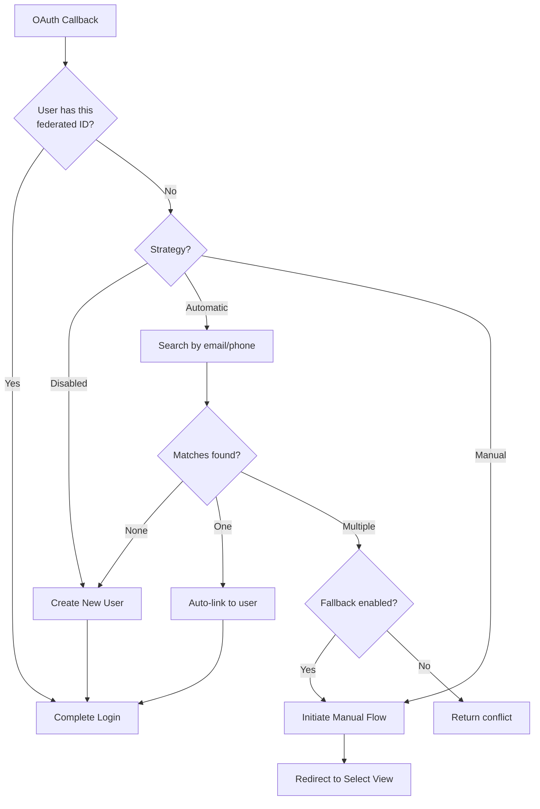
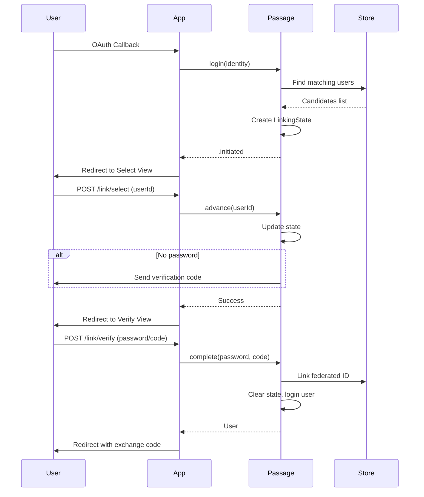

# Account Linking

Links OAuth logins to existing user accounts based on matching verified email or phone.

## Overview

Account Linking is always triggered from [Federated Login](../FederatedLogin/README.md). When a user logs in via OAuth, Passage searches for existing accounts with matching verified identifiers. Based on the configured strategy, it either automatically links the account or initiates a manual verification flow where the user selects and proves ownership of an existing account.

### Flow Outcomes

The Account Linking flow returns one of the following results:

| Result | Description |
|--------|-------------|
| `.complete` | New federated identity successfully linked to an existing user |
| `.initiated` | Manual linking flow started, user redirected to selection view |
| `.skipped` | Account linking disabled, or no matching candidates found |
| `.conflict` | Multiple candidates found but manual linking is disabled |

When `.conflict` is returned, the app developer needs to handle this case by providing appropriate UI for conflict resolution.

> **Note:** Currently the system handles `.skipped` and `.conflict` identically (creates a new user), as the `.conflict` response handling is not yet fully implemented.

## Configuration

```swift
// In your Passage configuration
Passage.Configuration(
    // ... other config ...
    federatedLogin: .init(
        providers: [.google, .github],
        accountLinking: .init(
            strategy: .automatic(
                allowed: [.email, .phone],              // Match by email and/or phone
                fallbackToManualOnMultipleMatches: true // Show selection UI if multiple matches
            ),
            stateExpiration: 600,                       // Manual flow session timeout (seconds)
            routes: .init(
                select: ["link", "select"],             // POST /auth/connect/link/select
                verify: ["link", "verify"]              // POST /auth/connect/link/verify
            )
        )
    )
)
```

### Configuration Options

| Option | Type | Default | Description |
|--------|------|---------|-------------|
| `strategy` | `Strategy` | `.disabled` | Linking behavior (see [Strategies](#strategies)) |
| `stateExpiration` | `TimeInterval` | `600` | How long manual linking state is valid (seconds) |
| `routes.select` | `[PathComponent]` | `["link", "select"]` | Path for user selection endpoint |
| `routes.verify` | `[PathComponent]` | `["link", "verify"]` | Path for verification endpoint |

**Note:** Route paths could be composed from multiple groups. For example, `/auth/connect/link/select` combines the main group `auth`, federated login group `connect`, and the `routes.select` path (`link/select`).

## Strategies

### Automatic Linking

Automatic linking searches for existing users with matching verified identifiers. It's the simplest approach when you expect most users to have a single account.

**Behavior:**
- **Single match found:** Automatically links the OAuth identity to the existing user
- **Multiple matches found:** Returns `.conflict` (or falls back to manual if `fallbackToManualOnMultipleMatches: true`)
- **No matches found:** Creates a new user account

**Important:** Only users with **verified** emails/phones are considered for automatic linking. This prevents account takeover through unverified claims.

### Manual Linking

Manual linking provides a UI flow where users select which existing account to link and then verify ownership.

**Three-Step Flow:**
1. **Initiate** - Find candidates, create linking state, redirect to selection view
2. **Select** - User chooses an account, verification code sent if no password
3. **Verify** - User proves ownership via password or verification code

**Verification Methods:**
- If the user **has a password**: verify with password
- If no password but **verified email**: send email verification code
- If no password but **verified phone**: send SMS verification code

### Completion & Redirect

When Account Linking completes successfully (either automatic or manual), the user is redirected to the configured `redirectLocation` with an exchange code appended as a query parameter:

```
https://myapp.com/callback?code=<exchange_code>
```

The exchange code is a short-lived, one-time-use token that can be exchanged for access and refresh tokens via the `/auth/exchange-code` endpoint. This allows API clients to obtain tokens after the browser-based OAuth flow completes.

The redirect location is configured in `federatedLogin.redirectLocation` (default: `/`).

## Routes & Endpoints

Account linking routes are nested under the federated login group (default: `/auth/connect`).

| Method | Default Path | Description | Handler |
|--------|--------------|-------------|---------|
| POST | `/auth/connect/link/select` | Submit selected user ID | [`RouteCollection`](Linking+ManualLinkingRouteCollection.swift) |
| POST | `/auth/connect/link/verify` | Verify with password or code | [`RouteCollection`](Linking+ManualLinkingRouteCollection.swift) |

## Flow Diagrams

### Automatic Linking Flow



### Manual Linking Flow



## Implementation Details

### State Management

The manual linking flow requires state persistence across multiple HTTP requests. The `LinkingStateStorage` automatically chooses the storage method based on your configuration:

**Session Storage** (when `sessions.enabled = true`):
- State stored as JSON in server-side session
- Relies on Vapor's session middleware

**Cookie Storage** (when sessions disabled):
- State encoded as signed JWT in HTTP-only cookie
- JWT signed with your app's JWKS keys
- Cookie attributes: `httpOnly`, `sameSite: .lax`, `secure` (in production)

### Candidate Matching Logic

For a user to be considered a linking candidate:

1. **Automatic Linking:**
   - User must have a **verified** email/phone matching the OAuth identity
   - Only verified identifiers are matched (prevents account takeover)

2. **Manual Linking:**
   - User must have a matching email/phone from the OAuth identity
   - User must be **verifiable**: has password OR has verified email/phone
   - Unverifiable users are excluded from candidates

## View Templates

Manual linking requires two Leaf view templates. Configure them in your `Views` configuration:

```swift
views: .init(
    linkAccountSelect: .init(path: "auth/link-select"),   // Show candidate selection
    linkAccountVerify: .init(path: "auth/link-verify")    // Password/code verification
)
```

## Related Features

- [Federated Login](../FederatedLogin/README.md) - OAuth provider integration that triggers account linking
- [Views](../Views/README.md) - Web form rendering for manual linking UI
- [Verification](../Verification/README.md) - Email/phone verification codes used in manual flow
