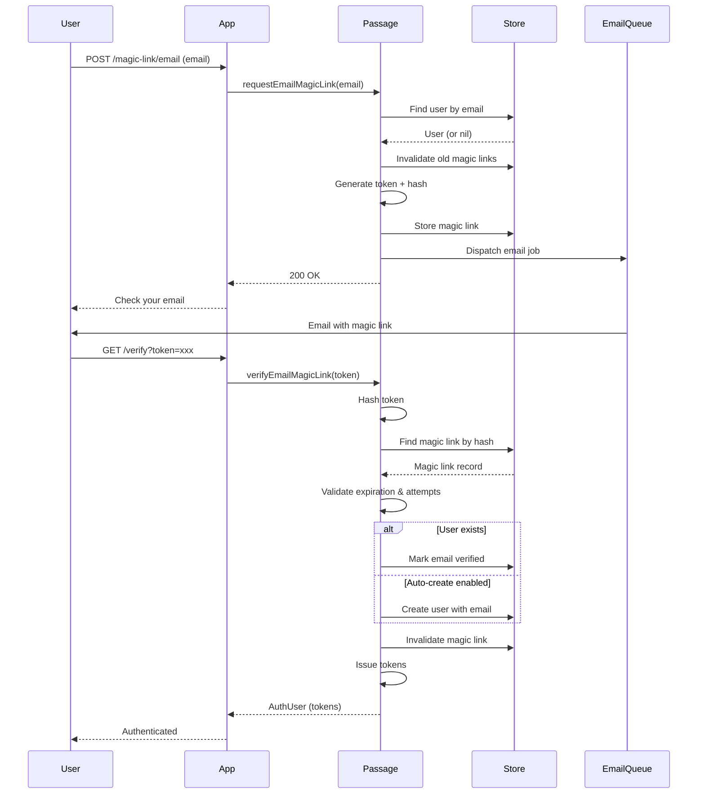

# Passwordless

Email-based magic link authentication allowing users to sign in without a password.

## Overview

The Passwordless feature implements magic link authentication - users receive a secure, time-limited link via email that authenticates them when clicked. This provides an alternative to password-based authentication with improved security (no passwords to leak) and better UX (no passwords to remember).

**Key capabilities:**
- Sign in existing users via email
- Auto-create new users on first sign-in (configurable)
- Same-browser verification for enhanced security (optional)
- Async email delivery via Vapor Queues

## Configuration

```swift
Passage.Configuration(
    // ... other config ...
    passwordless: .init(
        revokeExistingTokens: true,                    // Revoke old tokens on new login
        emailMagicLink: .email(
            routes: .email,                            // Default route paths
            useQueues: true,                           // Send emails async via Vapor Queues
            linkExpiration: 15 * 60,                   // 15 minutes
            maxAttempts: 5,                            // Max failed verification attempts
            autoCreateUser: true,                      // Create user if doesn't exist
            requireSameBrowser: false                  // Require verification in same browser
        )
    )
)
```

### Configuration Options

| Option | Type | Default | Description |
|--------|------|---------|-------------|
| `revokeExistingTokens` | `Bool` | `true` | Revoke existing refresh tokens when issuing new ones |
| `emailMagicLink` | `MagicLink?` | `.email()` | Email magic link config (nil to disable) |
| `emailMagicLink.useQueues` | `Bool` | `true` | Send emails via Vapor Queues (async) |
| `emailMagicLink.linkExpiration` | `TimeInterval` | `900` (15 min) | Magic link validity duration |
| `emailMagicLink.maxAttempts` | `Int` | `5` | Max failed verification attempts before invalidation |
| `emailMagicLink.autoCreateUser` | `Bool` | `true` | Create new user if email not found |
| `emailMagicLink.requireSameBrowser` | `Bool` | `false` | Require verification from same browser session |

## Magic Link Flow

### Request Flow

1. User submits email address
2. System finds existing user (or allows new user if `autoCreateUser: true`)
3. Any existing magic links for this email are invalidated
4. New magic link token generated and hashed
5. Token stored with expiration time
6. Email sent with verification link (sync or via queue)

### Verification Flow

1. User clicks link in email
2. Token extracted from URL query parameter
3. Token hashed and looked up in store
4. Validation checks: not expired, attempts within limit
5. Same-browser check (if enabled)
6. User found or created (if `autoCreateUser: true`)
7. Email marked as verified
8. Magic link invalidated (one-time use)
9. JWT access + refresh tokens issued

### Auto-Create User

When `autoCreateUser: true`, users who don't exist are created during verification:
- New user created with email identifier
- Email automatically marked as verified
- No password set (passwordless-only user)

When `autoCreateUser: false`, requesting a magic link for unknown email throws `magicLinkEmailNotFound`.

## Routes & Endpoints

| Method | Default Path | Description |
|--------|--------------|-------------|
| POST | `/auth/magic-link/email` | Request magic link |
| GET | `/auth/magic-link/email/verify` | Verify token (from email link) |
| POST | `/auth/magic-link/email/resend` | Resend magic link |

**Magic Link URL Format:**
```
https://yourapp.com/auth/magic-link/email/verify?token=<opaque_token>
```

## Flow Diagram



## Implementation Details

### Token Security

Magic link tokens use a secure design:
- **Opaque tokens** - Random, unpredictable values
- **Hashed storage** - Only SHA256 hash stored in database, never plaintext
- **Single use** - Invalidated immediately after successful verification
- **Time-limited** - Configurable expiration (default 15 minutes)
- **Attempt limiting** - Tracks failed attempts to prevent brute force

### Same-Browser Verification

When `requireSameBrowser: true`:

**Request phase:**
1. Generate session token
2. Store hash in database with magic link
3. Store raw token in Vapor session (server-side)

**Verification phase:**
1. Retrieve session token from Vapor session
2. Hash and compare with stored hash
3. Mismatch throws `magicLinkDifferentBrowser`

This prevents leaked links from being used on different devices/browsers.

### Async Email Delivery

When `useQueues: true`, emails are sent via Vapor Queues:
- Non-blocking request handling
- Automatic retry (up to 3 attempts)
- Requires Vapor Queues configured in your app

When `useQueues: false`, emails are sent synchronously during the request.

### Error Handling

| Error | Trigger |
|-------|---------|
| `magicLinkInvalid` | Token not found or hash mismatch |
| `magicLinkExpired` | Link past expiration time |
| `magicLinkMaxAttempts` | Too many failed verification attempts |
| `magicLinkEmailNotFound` | Email not found and `autoCreateUser: false` |
| `magicLinkDifferentBrowser` | Verification from different browser (when required) |
| `emailDeliveryNotConfigured` | Email delivery service not set up |
| `emailMagicLinkNotConfigured` | Magic link feature disabled |

## View Templates

For HTML form-based flows, configure view templates:

```swift
views: .init(
    magicLinkRequest: .init(path: "auth/magic-link-request"),   // Request form
    magicLinkVerify: .init(path: "auth/magic-link-verify")      // Verification result
)
```

The request view shows a form for entering email. The verify view shows success or error messages after clicking the link.

## Related Features

- [Account](../Account/README.md) - Password-based authentication (alternative)
- [Tokens](../Tokens/README.md) - JWT access and refresh token management
- [Verification](../Verification/README.md) - Email verification codes (different from magic links)
- [Views](../Views/README.md) - HTML form rendering for web-based flows
