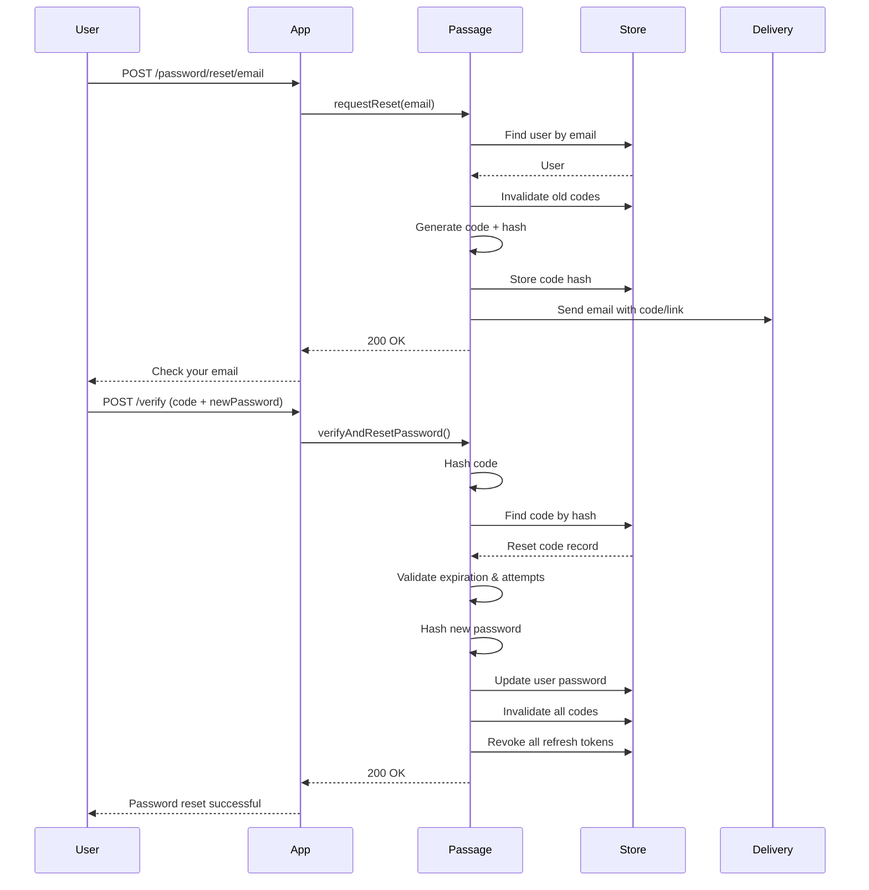

# Restoration

Password reset flows via email or phone verification codes.

## Overview

The Restoration feature enables users to reset their password when forgotten. Users request a reset code sent to their email or phone, then verify the code while providing a new password. On successful reset, all existing refresh tokens are revoked, forcing re-authentication on all devices.

**Key capabilities:**
- Email-based password reset with clickable link
- Phone-based password reset via SMS code
- Configurable code length, expiration, and max attempts
- Async delivery via Vapor Queues
- Automatic token revocation on password change

## Configuration

```swift
Passage.Configuration(
    // ... other config ...
    restoration: .init(
        preferredDelivery: .email,                  // Fallback for username/federated login
        email: .init(
            codeLength: 6,                          // Reset code length
            codeExpiration: 15 * 60,                // 15 minutes
            maxAttempts: 3                          // Max verification attempts
        ),
        phone: .init(
            codeLength: 6,
            codeExpiration: 5 * 60,                 // 5 minutes (shorter for SMS)
            maxAttempts: 3
        ),
        useQueues: true                             // Send via Vapor Queues
    )
)
```

### Configuration Options

| Option | Type | Default | Description |
|--------|------|---------|-------------|
| `preferredDelivery` | `DeliveryType` | `.email` | Delivery channel to send reset code |
| `useQueues` | `Bool` | `false` | Send codes via Vapor Queues (async) |

**Email Options:**

| Option | Type | Default | Description |
|--------|------|---------|-------------|
| `email.codeLength` | `Int` | `6` | Number of digits in reset code |
| `email.codeExpiration` | `TimeInterval` | `900` (15 min) | Code validity duration |
| `email.maxAttempts` | `Int` | `3` | Max failed verification attempts |

**Phone Options:**

| Option | Type | Default | Description |
|--------|------|---------|-------------|
| `phone.codeLength` | `Int` | `6` | Number of digits in reset code |
| `phone.codeExpiration` | `TimeInterval` | `300` (5 min) | Code validity duration |
| `phone.maxAttempts` | `Int` | `3` | Max failed verification attempts |

## Password Reset Flow

### Request Flow

1. User submits email or phone number
2. System finds user by identifier
3. Existing reset codes for that identifier are invalidated
4. New code generated and hashed for storage
5. Code sent via email (with clickable link) or SMS

### Verification Flow

1. User provides reset code and new password
2. Code hashed and looked up in store
3. Validation: not expired, attempts within limit
4. New password hashed with BCrypt
5. User password updated in store
6. All reset codes for that identifier invalidated
7. All refresh tokens revoked (forces re-login everywhere)

### Security Measures

- **Code hashing** - Codes stored as hashes, never plaintext
- **Attempt limiting** - Prevents brute force (default: 3 attempts)
- **Token revocation** - All sessions invalidated on password change
- **Short expiration** - Email: 15 min, Phone: 5 min

## Routes & Endpoints

### Email Password Reset

| Method | Default Path | Description |
|--------|--------------|-------------|
| POST | `/auth/password/reset/email` | Request reset code |
| POST | `/auth/password/reset/email/verify` | Verify code and set new password |
| POST | `/auth/password/reset/email/resend` | Resend reset code |

### Phone Password Reset

| Method | Default Path | Description |
|--------|--------------|-------------|
| POST | `/auth/password/reset/phone` | Request reset code |
| POST | `/auth/password/reset/phone/verify` | Verify code and set new password |
| POST | `/auth/password/reset/phone/resend` | Resend reset code |

**Note:** Routes are only registered if the corresponding delivery service (email/phone) is configured.

**Email Reset Link Format:**
```
https://yourapp.com/auth/password/reset/email/verify?code=123456&email=user@example.com
```

## Flow Diagram



## Implementation Details

### Preferred Delivery Channel

When a user logs in with username or federated identity (OAuth), the system doesn't know their email/phone directly. The `preferredDelivery` setting determines which channel to use:

```swift
restoration: .init(
    preferredDelivery: .email    // Use email when identifier is username/federated
)
```

### Async Delivery

When `useQueues: true`, codes are sent via Vapor Queues:
- Non-blocking request handling
- Automatic retry (up to 3 attempts)
- Requires Vapor Queues configured in your app

Jobs registered:
- `SendEmailPasswordResetCodeJob`
- `SendPhonePasswordResetCodeJob`

### Error Handling

| Error | Trigger |
|-------|---------|
| `restorationCodeInvalid` | Code not found or hash mismatch |
| `restorationCodeExpired` | Code past expiration time |
| `restorationCodeMaxAttempts` | Too many failed verification attempts |
| `restorationIdentifierNotFound` | User with email/phone not found |
| `restorationDeliveryNotAvailable` | Delivery service not configured |

### Token Revocation

On successful password reset, **all refresh tokens** for the user are revoked. This:
- Logs out all devices/sessions
- Prevents stolen tokens from being used
- Forces re-authentication with the new password

### Email Delivery with Mailgun

For email-based password reset, use [passage-mailgun](https://github.com/rozd/passage-mailgun) - a ready-to-use Mailgun implementation:

## View Templates

For HTML form-based password reset, configure view templates:

```swift
views: .init(
    passwordResetRequest: .init(path: "auth/password-reset-request"),
    passwordResetVerify: .init(path: "auth/password-reset-verify")
)
```

## Related Features

- [Account](../Account/README.md) - Login where password reset may be needed
- [Verification](../Verification/README.md) - Email/phone verification (different from password reset)
- [Tokens](../Tokens/README.md) - Refresh tokens that are revoked on password reset
- [Views](../Views/README.md) - HTML form rendering for web-based flows
