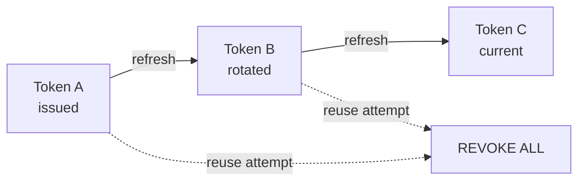
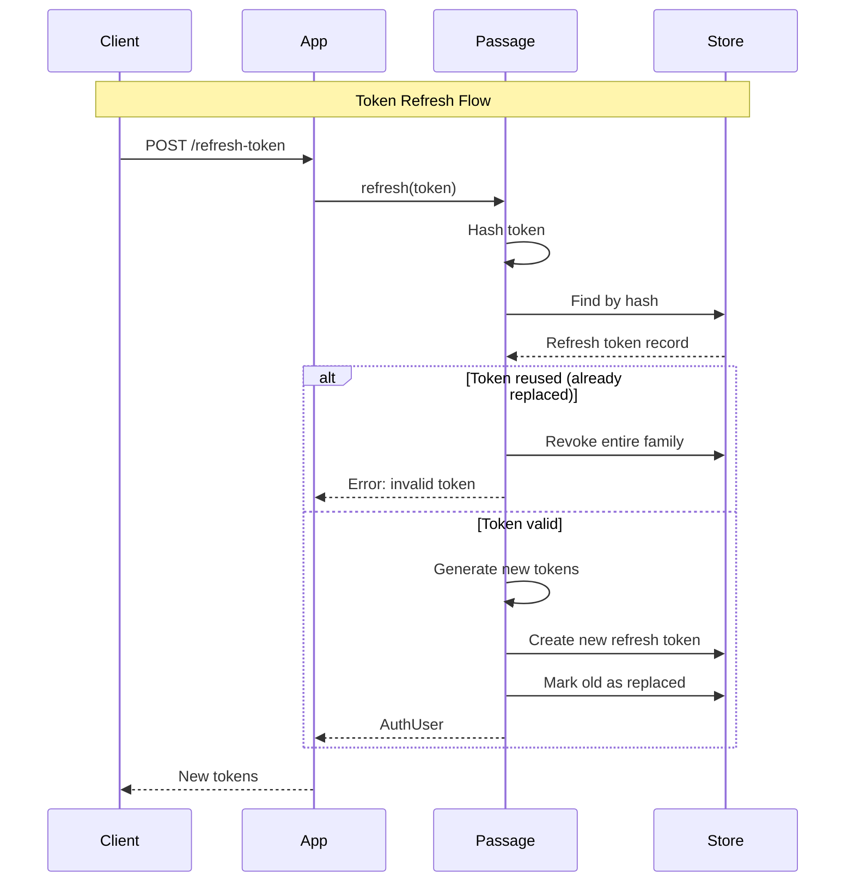

# Tokens

JWT access token issuance, opaque refresh token management, and token exchange flows.

## Overview

The Tokens feature manages authentication tokens throughout their lifecycle. It handles issuing JWT access tokens for API authentication, rotating refresh tokens for session continuity, and one-time exchange codes for OAuth redirect flows. Token rotation with family revocation provides security against token theft.

**Key capabilities:**
- JWT access tokens with standard claims (sub, exp, iat, iss, aud)
- Opaque refresh tokens with automatic rotation
- One-time exchange codes for OAuth callbacks
- Family-based token revocation on reuse detection

## Configuration

```swift
Passage.Configuration(
    // ... other config ...
    tokens: .init(
        issuer: "https://api.example.com",              // JWT issuer claim
        accessToken: .init(timeToLive: 15 * 60),        // 15 minutes
        refreshToken: .init(timeToLive: 7 * 24 * 3600)  // 7 days
    ),
    routes: .init(
        refreshToken: .init(path: "refresh-token"),     // POST /auth/refresh-token
        exchangeCode: .init(path: "exchange")           // POST /auth/exchange
    )
)
```

### Configuration Options

| Option | Type | Default | Description |
|--------|------|---------|-------------|
| `tokens.issuer` | `String?` | `nil` | JWT `iss` claim value |
| `tokens.accessToken.timeToLive` | `TimeInterval` | `900` (15 min) | Access token validity duration |
| `tokens.refreshToken.timeToLive` | `TimeInterval` | `604800` (7 days) | Refresh token validity duration |

## Token Types

### Access Token (JWT)

Short-lived JWT for API authentication. Validated on each request via `PassageBearerAuthenticator`.

**Claims:**
| Claim | Description |
|-------|-------------|
| `sub` | User ID |
| `exp` | Expiration timestamp |
| `iat` | Issued at timestamp |
| `iss` | Token issuer (optional) |
| `aud` | Intended audience (optional) |
| `scope` | Authorization scope (optional) |

### Refresh Token (Opaque)

Long-lived opaque token stored **hashed** in database. Used to obtain new access tokens without re-authentication.

**Properties:**
- Stored as SHA256 hash (plain text never persisted)
- Linked to user via `userId`
- Tracks rotation chain via `replacedById`
- Supports revocation via `revokedAt`

### Exchange Token

One-time code for OAuth redirect flows. Allows secure token handoff after browser-based OAuth.

**Properties:**
- **TTL**: 60 seconds
- **Single-use**: Consumed immediately on exchange
- Enables API clients to receive tokens after OAuth callback

## Token Lifecycle

### Issue (Login/OAuth)

1. Generate JWT access token with user claims
2. Generate random opaque refresh token
3. Hash refresh token and store in database
4. Return `AuthUser` with both tokens

### Refresh

1. Hash incoming refresh token
2. Look up in database by hash
3. Validate: not expired, not revoked, not replaced
4. If invalid → **revoke entire token family** (security)
5. Generate new access + refresh tokens
6. Mark old token as replaced by new one
7. Return new `AuthUser`

### Revoke (Logout/Password Change)

1. Find all refresh tokens for user
2. Mark as revoked
3. User must re-authenticate

## Token Rotation & Family Revocation

Passage implements **refresh token rotation** to detect token theft:



**Security behavior:**
1. Each refresh issues a **new** refresh token
2. Old token marked as replaced (`replacedById`)
3. Reusing a replaced token → **entire family revoked**
4. Detects stolen tokens being used after legitimate refresh

## Routes & Endpoints

| Method | Default Path | Auth | Description |
|--------|--------------|------|-------------|
| POST | `/auth/refresh-token` | No | Exchange refresh token for new tokens |
| POST | `/auth/exchange` | No | Exchange one-time code for tokens |

### Refresh Token

**Request:**
```json
{
  "refreshToken": "opaque-refresh-token-string"
}
```

**Response:**
```json
{
  "accessToken": "eyJhbGciOiJSUzI1NiIs...",
  "refreshToken": "new-opaque-refresh-token",
  "tokenType": "Bearer",
  "expiresIn": 900,
  "user": {
    "id": "user-uuid",
    "email": "user@example.com",
    "phone": null
  }
}
```

### Exchange Code

**Request:**
```json
{
  "code": "exchange-code-from-redirect"
}
```

**Response:** Same format as refresh token.

## Flow Diagram



## Implementation Details

### Error Handling

| Error | Trigger |
|-------|---------|
| `refreshTokenNotFound` | Token hash not found in database |
| `invalidRefreshToken` | Token expired, revoked, or already replaced |

### Token Storage

Refresh tokens are stored with:
- `tokenHash` - SHA256 hash of opaque token
- `userId` - Owner of the token
- `expiresAt` - Expiration timestamp
- `revokedAt` - When revoked (null if active)
- `replacedById` - ID of replacement token (rotation chain)

### Exchange Code Flow

Used by OAuth/federated login to pass tokens via URL:

1. OAuth callback completes authentication
2. Server generates exchange code (`createExchangeCode`)
3. Redirect to client with `?code=xxx`
4. Client POSTs to `/auth/exchange`
5. Server validates code, returns full tokens
6. Code marked as consumed (single-use)

## Related Features

- [Account](../Account/README.md) - Login issues tokens, logout revokes them
- [Restoration](../Restoration/README.md) - Password reset revokes all tokens
- [Federated Login](../FederatedLogin/README.md) - OAuth flows use exchange codes
