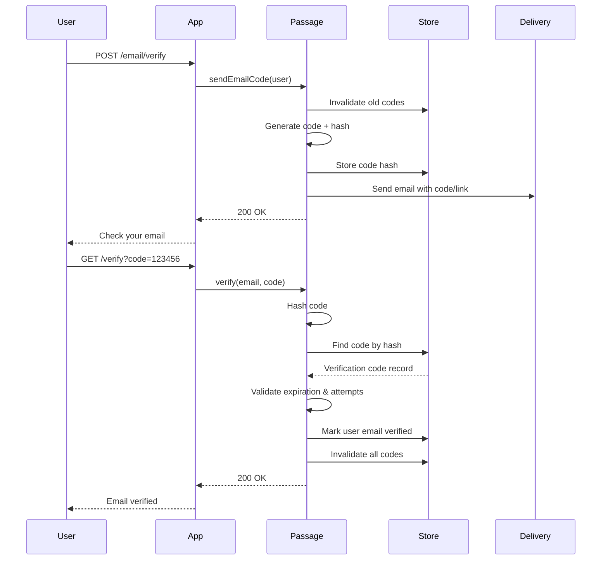

# Verification

Email and phone verification flows for user identity confirmation.

## Overview

The Verification feature confirms user ownership of email addresses and phone numbers. After registration, users receive a verification code via email or SMS that must be submitted to mark their identifier as verified. Unverified users are blocked from login until verification is complete.

**Key capabilities:**
- Email verification with clickable link or manual code entry
- Phone verification via SMS code
- Configurable code length, expiration, and max attempts
- Async delivery via Vapor Queues (optional)
- Automatic post-registration verification

## Configuration

```swift
Passage.Configuration(
    // ... other config ...
    verification: .init(
        email: .init(
            codeLength: 6,                          // 6-digit code
            codeExpiration: 15 * 60,                // 15 minutes
            maxAttempts: 3                          // Max verification attempts
        ),
        phone: .init(
            codeLength: 6,
            codeExpiration: 5 * 60,                 // 5 minutes (shorter for SMS)
            maxAttempts: 3
        ),
        useQueues: true                             // Send via Vapor Queues
    )
)
```

### Configuration Options

| Option | Type | Default | Description |
|--------|------|---------|-------------|
| `useQueues` | `Bool` | `false` | Send codes via Vapor Queues (async) |

**Email Options:**

| Option | Type | Default | Description |
|--------|------|---------|-------------|
| `email.codeLength` | `Int` | `6` | Number of digits in verification code |
| `email.codeExpiration` | `TimeInterval` | `900` (15 min) | Code validity duration |
| `email.maxAttempts` | `Int` | `3` | Max failed verification attempts |

**Phone Options:**

| Option | Type | Default | Description |
|--------|------|---------|-------------|
| `phone.codeLength` | `Int` | `6` | Number of digits in verification code |
| `phone.codeExpiration` | `TimeInterval` | `300` (5 min) | Code validity duration |
| `phone.maxAttempts` | `Int` | `3` | Max failed verification attempts |

## Verification Flow

### Send Code

1. User submits email or phone number
2. System finds user by identifier
3. Existing codes for that identifier are invalidated
4. New code generated and hashed for storage
5. Code sent via email (with clickable link) or SMS

### Verify Code

1. User provides verification code
2. Code hashed and looked up in store
3. Validation: not expired, attempts within limit
4. User's identifier marked as verified
5. All codes for that identifier invalidated
6. Optional confirmation message sent

### Security Measures

- **Code hashing** - Codes stored as SHA256 hashes, never plaintext
- **Attempt limiting** - Prevents brute force (default: 3 attempts)
- **Code invalidation** - Old codes invalidated when new one requested
- **Short expiration** - Email: 15 min, Phone: 5 min

## Routes & Endpoints

### Email Verification

| Method | Default Path | Description |
|--------|----------------------|-------------|
| POST   | `/auth/email/verify` | Request verification code |
| GET    | `/auth/email/verify` | Verify code (from email link) |
| POST   | `/auth/email/resend` | Resend verification code |

**Email Verification Link Format:**
```
https://yourapp.com/auth/email/verify?code=123456&email=user@example.com
```

### Phone Verification

| Method | Default Path | Description |
|--------|--------------|-------------|
| POST | `/auth/phone/send-code` | Request verification code |
| POST | `/auth/phone/verify` | Verify code |
| POST | `/auth/phone/resend` | Resend verification code |

**Note:** Routes are only registered if the corresponding delivery service (email/phone) is configured.

## Flow Diagram



## Implementation Details

### Async Delivery (Queues)

When `useQueues: true`, codes are sent via Vapor Queues:
- Non-blocking request handling
- Automatic retry (up to 3 attempts)
- Requires Vapor Queues configured in your app

Jobs registered:
- `SendEmailCodeJob`
- `SendPhoneCodeJob`

### Auto-Verification After Registration

Verification is automatically triggered after user registration:

```swift
// In Account.register() - fire-and-forget pattern
try await verification.sendVerificationCode(
    for: user,
    identifierKind: credential.identifier.kind
)
```

Registration succeeds even if verification code fails to send.

### Error Handling

| Error | Trigger |
|-------|---------|
| `emailDeliveryNotConfigured` | Email delivery service not provided |
| `phoneDeliveryNotConfigured` | Phone delivery service not provided |
| `emailNotSet` | User has no email address |
| `phoneNotSet` | User has no phone number |
| `emailAlreadyVerified` | Email is already verified |
| `phoneAlreadyVerified` | Phone is already verified |
| `invalidVerificationCode` | Code not found or hash mismatch |
| `verificationCodeExpiredOrMaxAttempts` | Code expired or too many failures |

### Delivery Protocols

Implement these protocols to provide email/SMS delivery:

```swift
protocol EmailDelivery {
    func sendEmailVerification(
        to email: String,
        user: any User,
        verificationURL: URL,
        verificationCode: String
    ) async throws
}

protocol PhoneDelivery {
    func sendPhoneVerification(
        to phone: String,
        code: String,
        user: any User
    ) async throws
}
```

### Email Delivery with Mailgun

For email delivery, use [passage-mailgun](https://github.com/rozd/passage-mailgun) - a ready-to-use Mailgun implementation:

## Related Features

- [Account](../Account/README.md) - Registration triggers verification, login blocks unverified users
- [Restoration](../Restoration/README.md) - Password reset (different from verification)
- [Linking](../Linking/README.md) - Manual account linking uses verification codes
