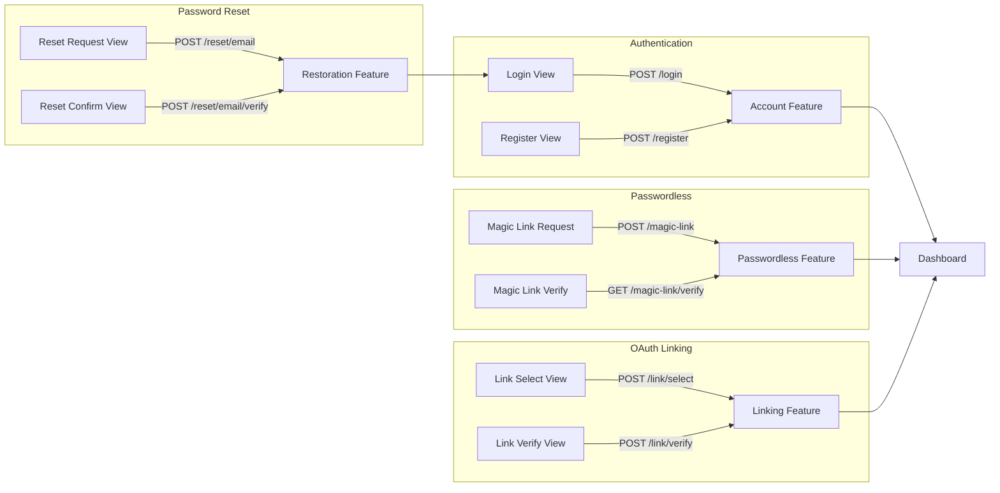

# Views

Server-rendered authentication UI using Leaf templates with customizable styles and themes.

## Overview

The Views feature provides pre-built HTML templates for authentication flows, rendered server-side using Vapor's Leaf templating engine. Views integrate with other Passage features (Account, Restoration, Passwordless, Linking) to provide a complete web-based authentication experience without building custom frontends.

**Key capabilities:**
- Pre-built login, registration, password reset, and magic link forms
- Four visual styles: Neobrutalism, Neomorphism, Minimalism, Material
- 20+ color themes with light/dark mode support
- OAuth account linking UI (select account, verify identity)
- Automatic error/success message handling via query params
- Custom redirect configuration per view

## Configuration

```swift
Passage.Configuration(
    // ... other config ...
    views: .init(
        login: .init(
            style: .material,
            theme: .init(colors: .oceanLight),
            redirect: .init(onSuccess: "/dashboard"),
            identifier: .email
        ),
        register: .init(
            style: .material,
            theme: .init(colors: .oceanLight),
            identifier: .email
        ),
        passwordResetRequest: .init(
            style: .material,
            theme: .init(colors: .oceanLight)
        ),
        passwordResetConfirm: .init(
            style: .material,
            theme: .init(colors: .oceanLight)
        ),
        magicLinkRequest: .init(
            style: .material,
            theme: .init(colors: .oceanLight)
        ),
        magicLinkVerify: .init(
            style: .material,
            theme: .init(colors: .oceanLight),
            redirect: .init(onSuccess: "/dashboard")
        ),
        linkAccountSelect: .init(
            style: .material,
            theme: .init(colors: .oceanLight)
        ),
        linkAccountVerify: .init(
            style: .material,
            theme: .init(colors: .oceanLight)
        )
    )
)
```

### Available Views

| View | Purpose | Related Feature |
|------|---------|-----------------|
| `login` | Email/phone/username + password login | [Account](../Account/README.md) |
| `register` | User registration form | [Account](../Account/README.md) |
| `passwordResetRequest` | Request password reset code | [Restoration](../Restoration/README.md) |
| `passwordResetConfirm` | Enter code and new password | [Restoration](../Restoration/README.md) |
| `magicLinkRequest` | Request magic link email | [Passwordless](../Passwordless/README.md) |
| `magicLinkVerify` | Magic link verification result | [Passwordless](../Passwordless/README.md) |
| `linkAccountSelect` | Select account to link (OAuth) | [Linking](../Linking/README.md) |
| `linkAccountVerify` | Verify ownership for linking | [Linking](../Linking/README.md) |

### View Options

| Option | Type | Default | Description |
|--------|------|---------|-------------|
| `style` | `Style` | - | Visual style (required) |
| `theme` | `Theme` | - | Color theme (required) |
| `redirect` | `Redirect` | `nil` | Custom redirect URLs |
| `identifier` | `Identifier.Kind` | - | Login/register identifier type |

### Redirect Options

| Option | Type | Default | Description |
|--------|------|---------|-------------|
| `onSuccess` | `String?` | `nil` | URL to redirect after success |
| `onFailure` | `String?` | `nil` | URL to redirect after failure |

## Routes & Endpoints

Views register GET routes that render HTML pages:

| Method | Path | View | Description |
|--------|------|------|-------------|
| GET | `/auth/login` | `login` | Login form |
| GET | `/auth/register` | `register` | Registration form |
| GET | `/auth/reset/email/request` | `passwordResetRequest` | Request reset (email) |
| GET | `/auth/reset/phone/request` | `passwordResetRequest` | Request reset (phone) |
| GET | `/auth/reset/email/verify` | `passwordResetConfirm` | Confirm reset (email) |
| GET | `/auth/reset/phone/verify` | `passwordResetConfirm` | Confirm reset (phone) |
| GET | `/auth/magic-link/request` | `magicLinkRequest` | Request magic link |
| GET | `/auth/connect/link/select` | `linkAccountSelect` | Select account to link |
| GET | `/auth/connect/link/verify` | `linkAccountVerify` | Verify account ownership |

## Styles

Four built-in visual styles are available:

| Style | Description |
|-------|-------------|
| `.neobrutalism` | Bold borders, strong shadows, high contrast |
| `.neomorphism` | Soft shadows, subtle depth, modern feel |
| `.minimalism` | Clean lines, whitespace-focused, understated |
| `.material` | Google Material Design inspired |

## Themes

### Built-in Color Palettes

Each theme has light and dark variants:

| Theme | Light | Dark |
|-------|-------|------|
| Default | `.defaultLight` | `.defaultDark` |
| Ocean | `.oceanLight` | `.oceanDark` |
| Forest | `.forestLight` | `.forestDark` |
| Sunset | `.sunsetLight` | `.sunsetDark` |
| Midnight | `.midnightLight` | `.midnightDark` |
| Cherry | `.cherryLight` | `.cherryDark` |
| Lavender | `.lavenderLight` | `.lavenderDark` |
| Mocha | `.mochaLight` | `.mochaDark` |
| Slate | `.slateLight` | `.slateDark` |
| Ember | `.emberLight` | `.emberDark` |
| Mint | `.mintLight` | `.mintDark` |
| Plum | `.plumLight` | `.plumDark` |
| Amber | `.amberLight` | `.amberDark` |
| Sage | `.sageLight` | `.sageDark` |
| Rose | `.roseLight` | `.roseDark` |
| Indigo | `.indigoLight` | `.indigoDark` |
| Coral | `.coralLight` | `.coralDark` |

### Custom Theme Colors

Create custom themes by defining all color properties:

```swift
let customTheme = Theme(
    colors: .init(
        primary: "#6200EE",
        onPrimary: "#FFFFFF",
        secondary: "#03DAC6",
        onSecondary: "#000000",
        surface: "#FFFFFF",
        onSurface: "#000000",
        onSurfaceVariant: "#616161",
        background: "#F5F5F5",
        onBackground: "#000000",
        error: "#B00020",
        onError: "#FFFFFF",
        warning: "#FF9800",
        onWarning: "#000000",
        success: "#4CAF50",
        onSuccess: "#FFFFFF",
        outline: "#BDBDBD"
    ),
    overrides: [
        .dark: .init(colors: .defaultDark)
    ]
)
```

### Theme Color Properties

| Property | Usage |
|----------|-------|
| `primary` | Primary action buttons, links |
| `onPrimary` | Text/icons on primary background |
| `secondary` | Secondary actions, accents |
| `onSecondary` | Text/icons on secondary background |
| `surface` | Card backgrounds, form containers |
| `onSurface` | Primary text on surfaces |
| `onSurfaceVariant` | Secondary/muted text |
| `background` | Page background |
| `onBackground` | Text on page background |
| `error` | Error states, validation errors |
| `onError` | Text on error background |
| `warning` | Warning states |
| `onWarning` | Text on warning background |
| `success` | Success states, confirmations |
| `onSuccess` | Text on success background |
| `outline` | Borders, dividers |

## Flow Diagram



## Implementation Details

### View Context

Each view receives a `Context` with theme colors and view-specific params:

```swift
struct Context<Params>: Encodable {
    let theme: Theme.Resolved  // Resolved colors for current brightness
    let params: Params         // View-specific parameters
}
```

### Query Parameters

Views read success/error messages from query parameters:

| Parameter | Description |
|-----------|-------------|
| `success` | Success message to display |
| `error` | Error message to display |
| `identifier` | Pre-filled identifier value |
| `code` | Reset/verification code |

### Leaf Template Registration

Passage registers bundled templates as a Leaf source named `passage`:

```swift
// Templates are automatically registered from:
// Sources/Passage/Resources/Views/
```

### Error Handling

| Error | Trigger |
|-------|---------|
| `Abort(.notFound)` | View not configured but route accessed |
| `ValidationsError` | Form validation failed |
| `AbortError` | Business logic error (invalid credentials, etc.) |

### Account Linking Views

The linking views (`linkAccountSelect`, `linkAccountVerify`) work with the manual linking flow:

1. **Select View**: Shows list of candidate accounts with masked identifiers
2. **Verify View**: Prompts for password or email code verification

Context includes:
- `provider`: OAuth provider name
- `candidates`: List of matching accounts with masked emails/phones
- `maskedEmail/maskedPhone`: Partially hidden identifiers
- `hasPassword`: Whether user can verify via password
- `canUseEmailCode`: Whether email verification is available

## Related Features

- [Account](../Account/README.md) - Login/registration backend
- [Restoration](../Restoration/README.md) - Password reset backend
- [Passwordless](../Passwordless/README.md) - Magic link backend
- [Linking](../Linking/README.md) - OAuth account linking backend
- [Federated Login](../FederatedLogin/README.md) - OAuth authentication
